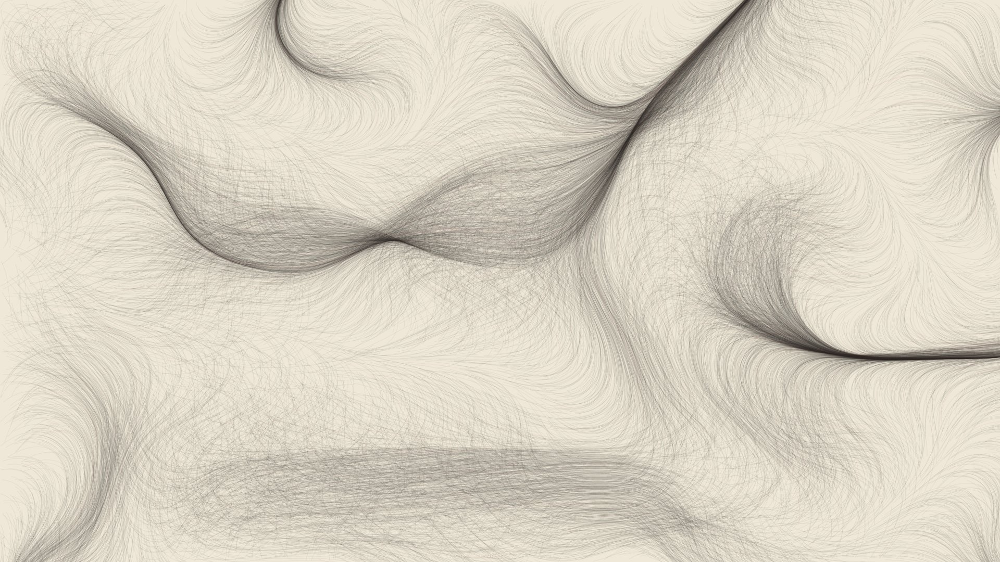

# Ink Flow

Thousands of ink particles trace an invisible flow field, slowly building up a drawing like hair or windblown grass. Once a drawing matures it fades away, and a new field starts a new one.

**URL:** `https://rajathpi.github.io/screensavers/ink-flow/`

## Options

| Option | Default | What it does |
|---|---|---|
| `palette` | `ink` | `ink` (dark on paper), `night`, `ember` or `sea` |
| `minutes` | `4` | How long each drawing builds before it fades |
| `density` | `1` | Particle count multiplier |

## How it works

Particles step along angles taken from 3D Perlin noise and leave faint strokes on a single canvas, so the drawing accumulates without any memory growth.
