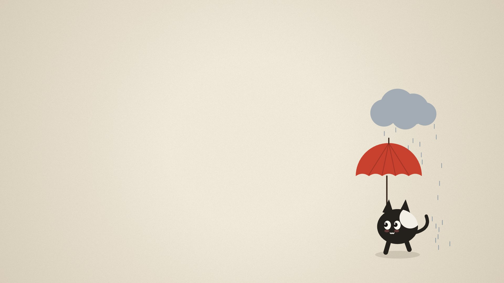

# Peekaboo

A small ink cat wanders onto the paper now and then and does something different each time, with quiet empty paper in between. Its coat, size, direction and timing change on every visit.

**URL:** `https://rajathpi.github.io/screensavers/peekaboo/`

## Skits

| Skit | What happens |
|---|---|
| `peekSide` | Peeks in from a side edge, looks around, then ducks back or makes a run for it |
| `peekBottom` | Pops up from the bottom edge, looks left and right, sinks back down |
| `peekTop` | Hangs upside down from the top edge and sways |
| `dash` | Sprints across, sometimes skidding to a stop halfway to stare at you |
| `tiptoe` | Sneaks across, freezes when it notices you, then bolts |
| `hop` | Bounces across in big hops |
| `balloon` | Floats up and away on a balloon |
| `umbrella` | Walks across under an umbrella, followed by its own rain cloud |
| `butterfly` | Chases a butterfly, jumping for it |
| `trip` | Runs, trips, rolls, sits dazed under spinning stars, gets up embarrassed |
| `skate` | Rides a skateboard across, with an ollie halfway |
| `nap` | Walks to the middle, yawns, curls up and sleeps for a while, then leaves |

## Options

| Option | Default | What it does |
|---|---|---|
| `gap` | `3-10` | Seconds of empty paper between skits, as `min-max` |
| `only` | all | Comma-separated skits to restrict to, e.g. `only=nap,umbrella` |
| `size` | `1` | Character size multiplier |

## How it works

Each skit is a short timeline of segments that set the cat's pose (position, squash, lean, leg phase, gaze, blink) every frame, and one procedural drawing routine turns that pose into the cat. Skits never repeat back to back. Rain, dust puffs and z's are capped, so memory stays flat.
