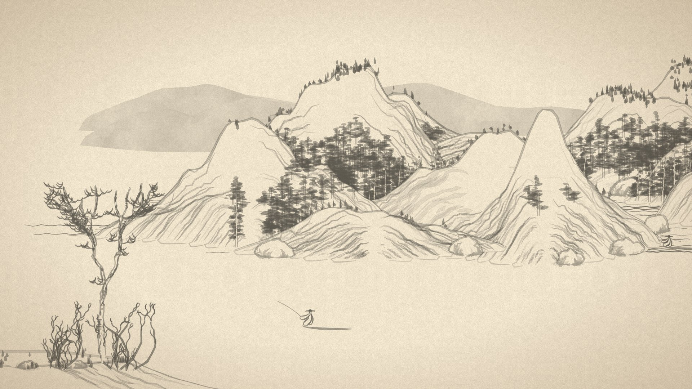

# Shan Shui

An endless Chinese ink landscape that scrolls slowly across the screen, like a handscroll being unrolled. Each display gets its own random seed, so with several monitors every screen shows a different landscape.



**URL:** `https://rajathpi.github.io/screensavers/shan-shui/`

## Options

Add these to the end of the URL, for example `.../shan-shui/?clock=1&speed=8`.

| Option | Default | What it does |
|---|---|---|
| `speed` | `14` | Scroll speed. `8` is slower and calmer, `30` is brisk |
| `dir` | `ltr` | `ltr` = scenery travels left→right (the way a handscroll is unrolled), `rtl` = right→left |
| `clock` | off | `1` shows a small red seal-style clock in the corner |
| `seed` | random | Fix the landscape to a word, e.g. `seed=lunch`, to get the same painting every time |

## How it works

- The landscape generator is [shan-shui-inf](https://github.com/LingDong-/shan-shui-inf) by Lingdong Huang (MIT, see [vendor/LICENSE](vendor/LICENSE)), vendored at upstream commit `9f754d2`.
- It runs in a Web Worker, so painting new scenery never stutters the scroll.
- The scenery is painted in panels one screen-height tall. Each panel is an SVG image, and panels are created ahead of the camera and dropped once they've scrolled past, so memory stays flat for hours.
- The scroll pauses rather than moving into a blank area if painting ever falls behind.

## Editing

`index.html` is generated, so don't edit it directly. Edit `template.html`, then rebuild:

```bash
py build.py
```
